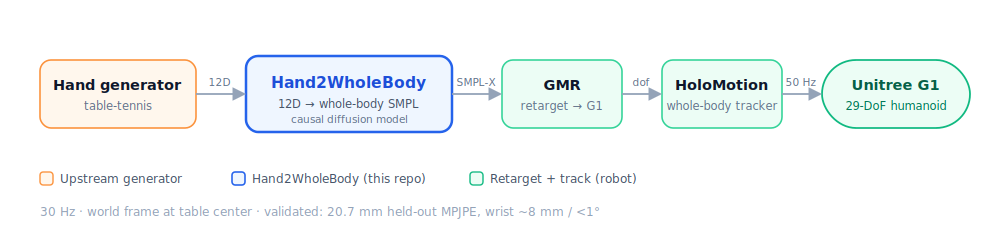
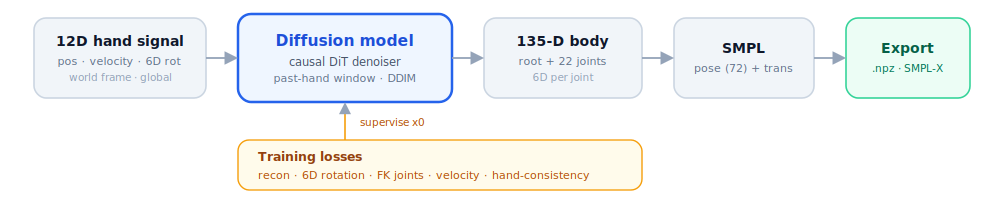
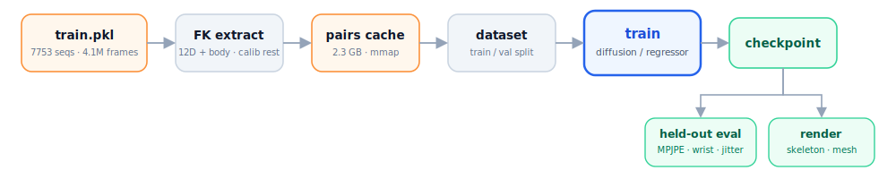

# Hand2Body

Generate **whole-body SMPL motion** from a **single left-hand 12D signal**, for the
table-tennis humanoid pipeline:

<p align="center"></p>

- **Input** (per frame, left wrist = SMPL joint 20): `[pos(3), lin_vel(3), rot6D(6)]`,
  world frame, **global** wrist orientation. Forehand/backhand is encoded by that
  orientation.
- **Output**: AMASS-style SMPL `.npz` at 30 Hz (plain SMPL — rigid wrist, no fingers).
- **Causal / streaming** (real-time on the robot).

👉 **Read [`docs/CONTRACT.md`](docs/CONTRACT.md) first** — it pins the world frame, the 12D
semantics, the SMPL output format, and the open upstream questions. All code
constants come from [`configs/default.yaml`](configs/default.yaml).

## Model & I/O

<p align="center"></p>

## Training & data flow

<p align="center"></p>

## Quickstart

The 6D convention is Zhou-2019 columns (`frames.PROJECT_R6D`); the models map
`hand[1..L] → body[1..L]` causally. `train.pkl` is a joblib pickle of SMPL 22-joint
`poses [T,66]` + `trans`. Measured results: [results.md](docs/results.md). Run the suite with `pytest`.

```bash
python scripts/train.py --synthetic                                     # smoke-test the loop, no data
python scripts/train.py --pkl train.pkl --arch diffusion --steps 20000  # train on real data (FK-extracts the 12D)
python scripts/generate.py --arch diffusion --checkpoint checkpoints/diffusion.pt --hand H.npy --out out.npz
python -m h2b.export.aitviewer_vis --input out.npz                     # view a generated clip
```

### Mesh visualization (aitviewer)

One-time setup for the SMPL body-mesh render: download the official SMPL models
(`smpl.is.tue.mpg.de`), then convert + render:

```bash
python -m uv pip install --python .venv --no-build-isolation chumpy    # one-time, for the conversion
python scripts/clean_smpl_models.py --src .../SMPL_python_v.1.1.0/smpl/models --out .../smpl_models
python scripts/render_aitviewer.py --cache data/cache/pairs_full.npz \
    --checkpoint checkpoints/diffusion_full.pt --smpl-models .../smpl_models --out mesh.mp4
```

`clean_smpl_models.py` converts the chumpy/numpy-1 release into the `SMPL_{GENDER}.pkl` layout
smplx/aitviewer expect (works under numpy 2.x). `h2b.export.visualize` + `scripts/render_video.py`
are a schematic, dependency-light headless fallback (no models needed).

## Layout

```
assets/urdf/        ball · table · g1 pingpong   (world-frame source of truth)
configs/            default.yaml
docs/               CONTRACT.md (data contract) · stage3_runbook.md (GMR→HoloMotion) · results.md · img/
h2b/
  representations/  rotations, frames (world/SMPL/12D), body (135-D), rotations_torch
  data/             smpl_fk (SMPL→12D), pkl_loader (train.pkl), cache, dataset
  models/           diffusion (DiT denoiser), regressor, fk_torch, streaming
  losses.py · inference.py · training.py · eval.py
  export/           to_amass_npz (SMPL/SMPL-X), aitviewer_vis, visualize
scripts/            train · generate · render_aitviewer · render_video · cache_pairs ·
                    clean_smpl_models · compare_models · inspect_pkl
tests/              pytest suite
```

## Setup

Use a Python 3.12 venv via `uv` (PyTorch needs the cu128 build on Blackwell GPUs):

```powershell
python -m uv venv --python 3.12 .venv
python -m uv pip install --python .venv -e ".[dev]"                                                # numpy, pyyaml, pytest
python -m uv pip install --python .venv --index-url https://download.pytorch.org/whl/cu128 torch   # GPU build
python -m uv pip install --python .venv -e ".[train]"                                              # smplx, trimesh, tqdm

$env:PYTHONPATH = (Get-Location).Path
.venv\Scripts\python.exe -m pytest -q
```

> Note: GMR / HoloMotion themselves run best under Linux/WSL2. Hand2Body training
> and the SMPL export are platform-independent; the Stage-3 retarget happens downstream.
